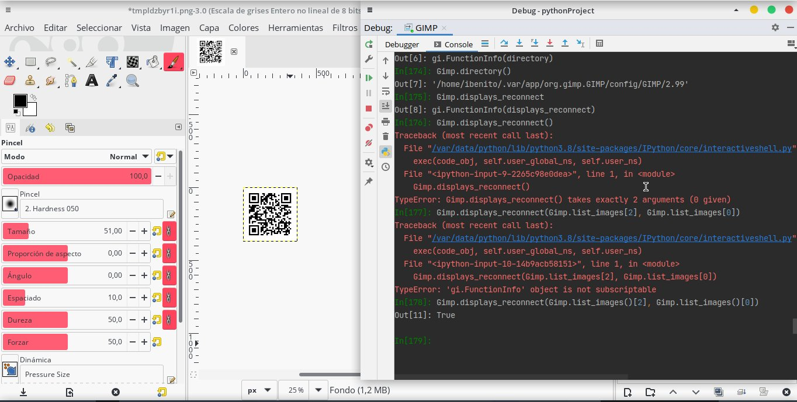
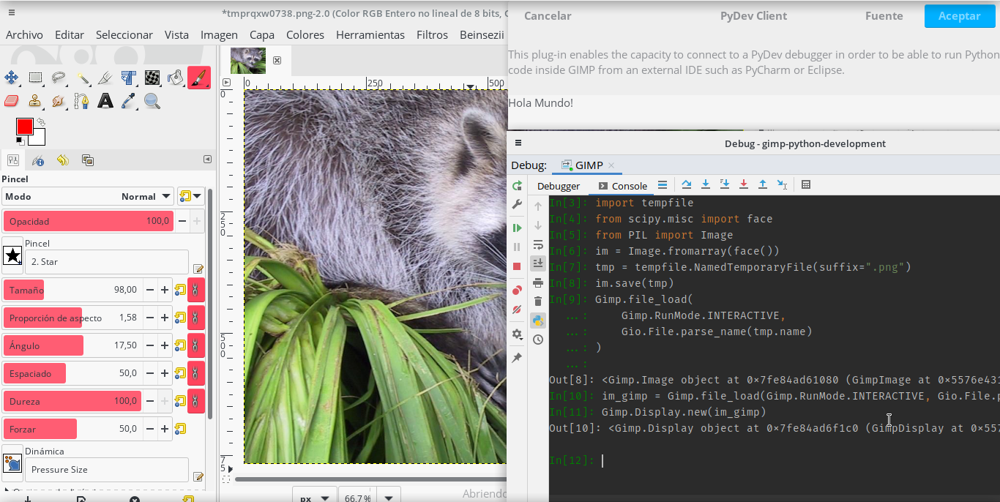

# gimp-python-development
Some ideas and tools to develop Python 3.8 plugins for GIMP 2.99.4. GIMP 2.99.4 is the latest unstable pre-release of GIMP 3. It suppots Python 3,
however it's documentation is rather poor, and also one thing that always annoyed me was it uses the system Python distribution and adds on top
of it some libraries. Also, a GIMP plugin must run inside GIMP... So, let's hack to have a proper developing environment!

## Install GIMP 2.99.4

GIMP 2.99.4 comes with pre-compiled binaries in a flatpak distribution. So, first of all if you don't have flatpak, assuming you are on a Debian-based
Linux distro: 

```
$ sudo apt install flatpak
```

Flatpak is a distribution system, like Apt, but focused on end-user applications and isolation. Like Docker, it isolates the compiled application
in its own Sandbox, however it is not actually virtualized. Let's install GIMP 2.99.4: 

```
flatpak remote-add --if-not-exists flathub https://dl.flathub.org/repo/flathub.flatpakrepo
flatpak remote-add --if-not-exists flathub https://dl.flathub.org/beta-repo/flathub.flatpakrepo
flatpak install --user https://flathub.org/beta-repo/appstream/org.gimp.GIMP.flatpakref
```
Say yes to permissions, etc. Then you will be able to run GIMP from flatpak: 

```
flatpak run org.gimp.GIMP//beta
```

## Understanding which Python is using GIMP 

So, in order to start developing we must understand which Python executable is using GIMP. This was tricky to me at first, but it actually has 
a very nice outcome. As I mentioned, GIMP uses the system Python executable, if we go to the menu entry 
`Filters > Development > Python-Fu > Python Console` a window will be prompt with a Python console that will say: 

```
GIMP 2.99.4 Python Console
Python 3.8.6 (default, Nov 10 2011, 15:00:00) 
[GCC 10.2.0]
>>> 
```

My main issue here to locate this Python was that I didn't have this Python installed in my system, because I'm using Python 3.9. Although, I don't
have any experience with Flatpak, Docker experience suggested that was using the Python provided by its isolation environment. So, searching 
the Flatpak documentation I found this approach: 

```
flatpak run --command=python org.gimp.GIMP//beta
```

And magic happened: 

```
Python 3.8.6 (default, Nov 10 2011, 15:00:00) 
[GCC 10.2.0] on linux
Type "help", "copyright", "credits" or "license" for more information.
>>>
```

Then, if we use this trick using `--comand=bash` instead of Python executable we will be having the shell of the Sandbox. So, when you thought it
this is very good news. Because, we finally have an isolated Python environment for GIMP, a tricky one, but we have it!!

## Prepare the environment

As it is thought as a minimal environment, it lacks some basic tools for developing Python code, let's install some of them. First, things 
firsts, let's ensure pip is installed: 

```
$ python -m ensurepip
```

Once installed, update pip using pip to check pip works!

```
$ python -m pip install -U pip
```

One pip is updated let's grab at least IPython:

```
$ python -m pip install ipython
```

Now, from inside the plug-in Python Console, we can verify that we can import IPython: 

```
>>> import IPython
>>> IPython.embed()
Python 3.8.6 (default, Nov 10 2011, 15:00:00) 
Type 'copyright', 'credits' or 'license' for more information
IPython 7.20.0 -- An enhanced Interactive Python. Type '?' for help.

In [1]: 
```

However, it will crash inmediadtely. This is because the plug-in messes up with `sys.stdout` and `sys.sterr` objects, needed to be able to reproduce
a 'console' application. So, there is possibility to improve the Python Console plug-in to become an IPython Console plug-in working on the
Python code of this plug-in and adapt the way it manages those two objects.


## Getting a minimal setup to develop code

Having an IPython terminal is an advantatge over Python, because we have some extra instructions and access to shell, using `!`. However, what 
we really want is to be able to run code externally from GIMP, to be able to rapidly prototype code, specially in Python. A possible solution 
could be use a [PyDev server](https://www.pydev.org/) - client scheme. PyDev was originally developed to be used inside Eclipse, but also PyCharm
has a port of its own. Where PyCharm or the IDE will act as a server for debugging and the app will act a client of that debugger. 

So, let's do that. In PyCharm go to `Edit Configurations ... > + > Python Debug Server`, there you will see the instructions to run this scheme
in a Python project. Mines are:

- Install pydevd-pycharm corresponding to a current PyCharm version:

```
pip install pydevd-pycharm~=203.7148.72
```

- Run this two lines inside your application (a.k.a GIMP): 

```python
import pydevd_pycharm
pydevd_pycharm.settrace('localhost', port=9000, stdoutToServer=True, stderrToServer=True)
```

If you try this two lines inside the plug-in Python Console you will end with the same problem than IPython, these two solutions rely on 
`sys.stdout` and `sys.stderr`, but we are not giving up. So the main idea is to execute those two lines. So easy, let's hack into the plug-in
files and put them. However, for the sake of the demo, let's use an even simpler plug-in, there is a bright new plug-ins templates for
several languages in a new location `Filters > Development > Goat Exercices > Excercise a goat and a python`. Which file is located (from 
the sandbox point of view) at `/app/lib/gimp/2.99/extensions/org.gimp.extension.goat-exercises/goat-exercise-py3.py` and from
the host point of view (and the editable one) at `~/.local/share/flatpak/app/org.gimp.GIMP/lib/gimp/2.99/extensions/org.gimp.extension.goat-exercises/goat-exercise-py3.py`

This plug-in is a simple 
plug-in where the current loaded GIMP image (thus you need one opened), is color inverted. We are going to hook to our server using this plug-in.

We can define a function to wrap the trace: 

```python
def set_trace(): return pydevd_pycharm.settrace('localhost', port=9000, stdoutToServer=True, stderrToServer=True)
```

So the question to ask now is where the hell I put this call. Obviously you want it to run when the plug-in starts, there is a line where the 
main method is defined: 

```python
def run(self, procedure, run_mode, image, drawable, args, run_data):
```

One can add the `set_trace()` call just there, however we will not know if it is actually running, and what is worse, we will freeze GIMP! So,
we need one last leap of faith and multiprocessing, more multiprocessing than faith. So, we have to add this import: 

```
import multiprocessing as mp
```

And just before the `while (True)` loop begins, we can add:

```python
th = mp.Process(target=set_trace)
th.start()
```

Before any return, this should be called `th.terminate()` to avoid another freeze. And it works! We are providing an isolated Python terminal
to the debugger, which is running inside GIMP process, so it has access to GIMP bindings. My case: 



## Modify the file

There is a modified version of the plug-in in the repo, you can use it to copy it to the app folder. However, notice that you need to use you 
actual environment and not the Sandbox, so, assuming that you are in the repo's root folder:

```
$ cp plug-ins/pydev/goat-exercise-py3.py ~/.local/share/flatpak/app/org.gimp.GIMP/current/active/files/lib/gimp/2.99/extensions/org.gimp.extension.goat-exercises
```

## Update: first version of PyDev plugin

To enable it, just declare in GIMP plugin paths your path to `plug-ins` folder of this repo. The
way to do so is in `Edit > Preferences > Folders > Scripts`. The reboot GIMP and look if there is a
new item under `Filers > Development > Python > PyDev Client`. Also notice you will need to install 
the plugin dependencies in the Python environment GIMP is using, in my case the Sandbox one, _check previous
sections of this readme_. **Before**, launching the plug-in you should have started the PyDev server inside PyCharm. 

Then you can run Python code directly from PyCharm, happy hacking. 




# TODO list

- ~~Create a minimal Python plug-in to create a PyDev client.~~ → First version available.
- Fork Python Console plug-in to be able to run IPython. Only forked, for the moment states
  the same functionality. Update: now 4 consoles are working, some of them are more responsive,
  but no IPython for the moment. 
- Create a minimal Python package which depends on IPython and pydev, and other dev stuff, to install
  it to be able to use the new plugins. 
- Create a pip wrapper to show useful info like `pip list` and also install PyPI packages from GIMP 
  to GIMP Python environment.
- ~~Define proper licence in the repo.~~ → GNU GPL v3 added.