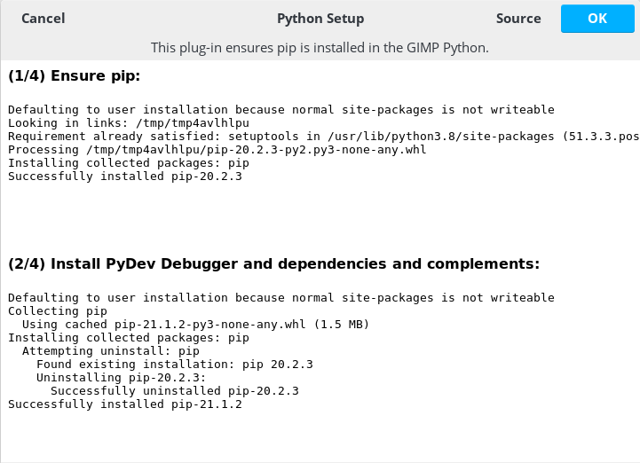
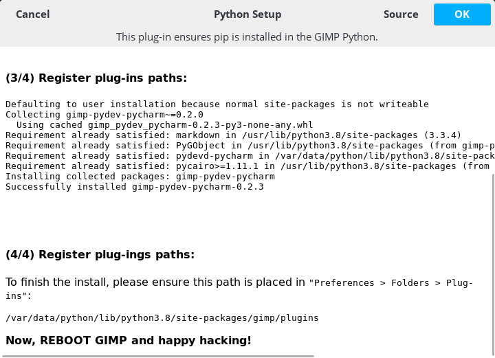

# gimp-python-development
Some ideas and tools to develop Python 3.8 plugins for GIMP 2.99.4. GIMP 2.99.4 is a unstable pre-release of GIMP 3. 
It suppots Python 3, however it's documentation is rather poor, this is why I have been playing around to configure
a setup to develope GIMP plugins based on Python. This aims to bring `pip` and related tools into the GIMP environment. 

Also, a GIMP plugin must run inside GIMP... So, let's hack to have a proper developing environment!

## Install GIMP 2.99.4

GIMP 2.99.4 comes with pre-compiled binaries in a flatpak distribution. So, first of all if you don't have flatpak, assuming you are on a Debian-based
Linux distro: 

```
$ sudo apt install flatpak
```

Flatpak is a distribution system, like Apt, but focused on end-user applications and isolation. Like Docker, it isolates the compiled application
in its own Sandbox, however it is not actually virtualized. Let's install GIMP 2.99.4: 

> :warning: **Note**: There is a problem with the 2.99.6 release involving matplotlib and cairo install in 
> the flatpak distribution. It will be addressed on the future. Thus, the commit of the flatpak GIMP where 
> version 2.99.4 was released will be pinned.

```
flatpak remote-add --if-not-exists flathub https://dl.flathub.org/repo/flathub.flatpakrepo
flatpak remote-add --if-not-exists flathub https://dl.flathub.org/beta-repo/flathub.flatpakrepo
flatpak install --user https://flathub.org/beta-repo/appstream/org.gimp.GIMP.flatpakref
flatpak update --commit=9878eaae0e90ac9395cfc7e62d85f8c4299769ddc7f19f3f20cd380ed72a9582 org.gimp.GIMP
```
Say yes to permissions, etc. Then you will be able to run GIMP from flatpak: 

```
flatpak run org.gimp.GIMP//beta
```

### Understanding which Python is using GIMP 

GIMP is using a sandboxed Python distribution inside its flatpak distribution. This is a tricky way to finally 
achieve a separate Python distribution for GIMP. If you start GIMP and go to the menu entry  
`Filters > Development > Python-Fu > Python Console` a window will be prompt with a Python console that will say: 

```
GIMP 2.99.4 Python Console
Python 3.8.6 (default, Nov 10 2011, 15:00:00) 
[GCC 10.2.0]
>>> 
```

If you want to access the Python Console directly from your terminal emulator, you can run: 

```
flatpak run --command=python org.gimp.GIMP//beta
```

Although this is possible, you have to remember that GIMP plugins have to run inside GIMP. This is because are
based upon libraries importer using the `gi.repository` API that are only present when we are running inside GIMP. 


## Python Setup plug-in

If you want to set up a development environment for Python plugins you will need to install some tools, for example
`pip` package manager and a debugger. To do so, a GIMP Python plugin has been developed which prepares the environment. 

1. Add to GIMP the path to this repo plug-ins folder `Preferences > Folders > Plug-ins`.
2. Reboot GIMP.
3. Go to a new entry on the menu `Python > Tools > Python Setup`, click and wait. A prompt should appear 
with the output of the steps executed to install the environment.
4. Remember to add your site-packages plug-in folder to `Preferences > Folders > Plug-ins`.





# TODO list

- ~~Create a minimal Python plug-in to create a PyDev client.~~ → First version available.
- Fork Python Console plug-in to be able to run IPython. Only forked, for the moment states
  the same functionality. Update: now 4 consoles are working, some of them are more responsive,
  but no IPython for the moment. 
- ~~Create a minimal Python package which depends on IPython and pydev, and other dev stuff, to install
  it to be able to use the new plugins.~~ 
- Create a pip wrapper to show useful info like `pip list` and also install PyPI packages from GIMP 
  to GIMP Python environment.
- ~~Define proper licence in the repo.~~ → GNU GPL v3 added.